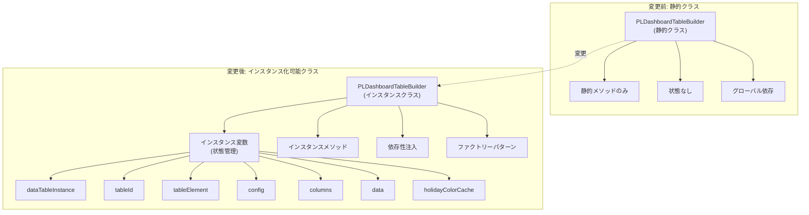

# PLDashboardTableBuilderの変更前後の比較

現在の静的メソッドのみのクラス [6-cite-0](#6-cite-0) から、インスタンス化可能なクラスへの変更における、変数とメソッドの変更を以下の図と表で示します `<cite/>`。

## クラス構造の変更図



## 変数の変更一覧

| 項目                 | 変更前 | 変更後                                                      | 説明                                     |
| -------------------- | ------ | ----------------------------------------------------------- | ---------------------------------------- |
| **クラス変数** | なし   | `private dataTableInstance: DataTablesApi \| null`         | DataTablesインスタンスを保持 `<cite/>` |
|                      | なし   | `private tableId: string`                                 | テーブルIDを保持 `<cite/>`             |
|                      | なし   | `private tableElement: HTMLTableElement \| null`           | テーブル要素を保持 `<cite/>`           |
|                      | なし   | `private config: TableBuilderConfig`                      | テーブル設定を保持 `<cite/>`           |
|                      | なし   | `private columns: string[]`                               | カラム定義を保持 `<cite/>`             |
|                      | なし   | `private data: TableRowData[]`                            | テーブルデータを保持 `<cite/>`         |
|                      | なし   | `private holidayColorCache: Map<string, string>`          | 休日色キャッシュを保持 `<cite/>`       |
|                      | なし   | `private calculationService: IBusinessCalculationService` | 計算サービス(DI)`<cite/>`              |
|                      | なし   | `private holidayStore: IHolidayStore`                     | 休日ストア(DI)`<cite/>`                |

## メソッドの変更一覧

### 基本DOM操作メソッド

| メソッド名                    | 変更前                                                                    | 変更後                                  | 変更内容                                                                    |
| ----------------------------- | ------------------------------------------------------------------------- | --------------------------------------- | --------------------------------------------------------------------------- |
| `createTable()`             | `static createTable(id: string, className?: string)` [6-cite-1](#6-cite-1) | `createTable(className?: string)`     | 静的→インスタンスメソッド化``idはコンストラクタで設定 `<cite/>`          |
| `createStickyTableHeader()` | `static createStickyTableHeader(columns: string[])` [6-cite-2](#6-cite-2)  | `createStickyTableHeader()`           | 静的→インスタンスメソッド化``columnsはインスタンス変数から取得 `<cite/>` |
| `createTableBody()`         | `static createTableBody(className?: string)` [6-cite-3](#6-cite-3)         | `createTableBody()`                   | 静的→インスタンスメソッド化 `<cite/>`                                    |
| `createTableCell()`         | `static createTableCell(content, isNumeric)` [6-cite-4](#6-cite-4)         | `createTableCell(content, isNumeric)` | 静的→インスタンスメソッド化 `<cite/>`                                    |
| `createTableRow()`          | `static createTableRow(cells, className?)` [6-cite-5](#6-cite-5)           | `createTableRow(cells, className?)`   | 静的→インスタンスメソッド化 `<cite/>`                                    |

### データフォーマットメソッド

| メソッド名             | 変更前                                                               | 変更後                                     | 変更内容                                 |
| ---------------------- | -------------------------------------------------------------------- | ------------------------------------------ | ---------------------------------------- |
| `formatNumber()`     | `static formatNumber(value, decimals)` [6-cite-6](#6-cite-6)          | `formatNumber(value, decimals)`          | 静的→インスタンスメソッド化 `<cite/>` |
| `formatPercentage()` | `static formatPercentage(value)` [6-cite-7](#6-cite-7)                | `formatPercentage(value)`                | 静的→インスタンスメソッド化 `<cite/>` |
| `calculateProfit()`  | `static calculateProfit(addedValue, totalCost)` [6-cite-8](#6-cite-8) | `calculateProfit(addedValue, totalCost)` | 静的→インスタンスメソッド化 `<cite/>` |

### テーブル作成メソッド

| メソッド名                              | 変更前                                                                                                                       | 変更後                                                 | 変更内容                                                                                             |
| --------------------------------------- | ---------------------------------------------------------------------------------------------------------------------------- | ------------------------------------------------------ | ---------------------------------------------------------------------------------------------------- |
| `createCompleteTable()`               | `static createCompleteTable(id, columns, data, options)` [6-cite-9](#6-cite-9)                                                | `build(): HTMLDivElement`                            | 大幅変更 ``インスタンス変数を使用``メソッドチェーン対応 `<cite/>`                                  |
| `createProductionPerformanceTable()`  | `static createProductionPerformanceTable(records, plMonthlyData, product_history_data, getDayOfWeek)` [6-cite-10](#6-cite-10) | `buildProductionTable(): HTMLDivElement`             | 静的→インスタンスメソッド化 ``データはsetData()で事前設定``後方互換用の静的ラッパー残存 `<cite/>` |
| `createProfitCalculationTable()`      | `static createProfitCalculationTable(dailyReportData, filteredRecords, ...)` [6-cite-11](#6-cite-11)                          | `buildProfitCalculationTable(): HTMLDivElement`      | 静的→インスタンスメソッド化``データはsetData()で事前設定 `<cite/>`                                |
| `createRevenueAnalysisSummaryTable()` | `static createRevenueAnalysisSummaryTable(RevenueAnalysisList)` [6-cite-12](#6-cite-12)                                       | `buildRevenueAnalysisSummaryTable(): HTMLDivElement` | 静的→インスタンスメソッド化 `<cite/>`                                                             |

### DataTables関連メソッド

| メソッド名                          | 変更前                                                                       | 変更後                              | 変更内容                                                                                               |
| ----------------------------------- | ---------------------------------------------------------------------------- | ----------------------------------- | ------------------------------------------------------------------------------------------------------ |
| `enhanceTableWithDataTables()`    | `static enhanceTableWithDataTables(tableId, options)` [6-cite-13](#6-cite-13) | `enhanceWithDataTables(options?)` | 静的→インスタンスメソッド化 ``tableIdはインスタンス変数から取得``インスタンスをキャッシュ `<cite/>` |
| `enhanceProductionTable()`        | `static enhanceProductionTable(tableId)` [6-cite-14](#6-cite-14)              | 削除                                | enhanceWithDataTables()に統合 `<cite/>`                                                              |
| `enhanceProfitCalculationTable()` | `static enhanceProfitCalculationTable(tableId)` [6-cite-15](#6-cite-15)       | 削除                                | enhanceWithDataTables()に統合 `<cite/>`                                                              |
| `enhanceRevenueSummaryTable()`    | `static enhanceRevenueSummaryTable(tableId)` [6-cite-16](#6-cite-16)          | 削除                                | enhanceWithDataTables()に統合 `<cite/>`                                                              |
| `destroyDataTable()`              | `static destroyDataTable(tableId)` [6-cite-17](#6-cite-17)                    | `destroy()`                       | 静的→インスタンスメソッド化 `<cite/>`                                                               |
| `updateTableData()`               | `static updateTableData(tableId, newData)` [6-cite-18](#6-cite-18)            | `updateData(newData)`             | 静的→インスタンスメソッド化``インスタンスのDataTablesを使用 `<cite/>`                               |
| `isDataTablesAvailable()`         | `static isDataTablesAvailable()` [6-cite-19](#6-cite-19)                      | `private isDataTablesAvailable()` | 静的→プライベートインスタンスメソッド化 `<cite/>`                                                   |

### 休日・スタイル関連メソッド

| メソッド名                         | 変更前                                                                    | 変更後                           | 変更内容                                                                    |
| ---------------------------------- | ------------------------------------------------------------------------- | -------------------------------- | --------------------------------------------------------------------------- |
| `getDateBackgroundColor()`       | `static getDateBackgroundColor(date, holidayData)` [6-cite-20](#6-cite-20) | `getDateBackgroundColor(date)` | 静的→インスタンスメソッド化``holidayDataはholidayStoreから取得 `<cite/>` |
| `createColorLegend()`            | `static createColorLegend()` [6-cite-21](#6-cite-21)                       | `createColorLegend()`          | 静的→インスタンスメソッド化 `<cite/>`                                    |
| `addColorLegendToDataTable()`    | `static addColorLegendToDataTable(tableId)` [6-cite-22](#6-cite-22)        | `addColorLegend()`             | 静的→インスタンスメソッド化``tableIdはインスタンス変数から取得 `<cite/>` |
| `addCompanyOperatingDaysLabel()` | `static addCompanyOperatingDaysLabel(tableId)` [6-cite-23](#6-cite-23)     | `addOperatingDaysLabel()`      | 静的→インスタンスメソッド化 `<cite/>`                                    |
| `applyCustomTableStyles()`       | `static applyCustomTableStyles(tableId)` [6-cite-24](#6-cite-24)           | `applyCustomStyles()`          | 静的→インスタンスメソッド化 `<cite/>`                                    |

### 新規追加メソッド

| メソッド名                                                          | 説明                                                   |
| ------------------------------------------------------------------- | ------------------------------------------------------ |
| `constructor(tableId, calculationService, holidayStore, config?)` | コンストラクタ``依存性注入とデフォルト設定 `<cite/>` |
| `setColumns(columns: string[]): this`                             | カラム設定``メソッドチェーン対応 `<cite/>`           |
| `setData(data: TableRowData[]): this`                             | データ設定``メソッドチェーン対応 `<cite/>`           |

Wiki pages you might want to explore:

- [UI Components (kent2980/k-tech_kintone_javascript)](/wiki/kent2980/k-tech_kintone_javascript#3)

### Citations

**File:** src/BOX/PL_dashboard/components/PLDashboardTableBuilder.ts (L50-50)

```typescript
export class PLDashboardTableBuilder {
```

**File:** src/BOX/PL_dashboard/components/PLDashboardTableBuilder.ts (L57-65)

```typescript
    static createTable(
        id: string,
        className: string = "recordlist-gaia recordlist-consistent-column-width-gaia"
    ): HTMLTableElement {
        const table = document.createElement("table");
        table.id = id;
        table.className = `pl-table-base ${className}`;
        return table;
    }
```

**File:** src/BOX/PL_dashboard/components/PLDashboardTableBuilder.ts (L72-87)

```typescript
    static createStickyTableHeader(columns: string[]): HTMLTableSectionElement {
        const thead = document.createElement("thead");
        thead.className = "pl-table-thead-sticky";

        const headerRow = document.createElement("tr");
        columns.forEach((column) => {
            const th = document.createElement("th");
            th.textContent = column;
            th.className =
                "pl-table-th-standard sorting recordlist-header-cell-gaia label-13458061 recordlist-header-sortable-gaia";
            headerRow.appendChild(th);
        });

        thead.appendChild(headerRow);
        return thead;
    }
```

**File:** src/BOX/PL_dashboard/components/PLDashboardTableBuilder.ts (L94-98)

```typescript
    static createTableBody(className: string = "recordlist-body-gaia"): HTMLTableSectionElement {
        const tbody = document.createElement("tbody");
        tbody.className = className;
        return tbody;
    }
```

**File:** src/BOX/PL_dashboard/components/PLDashboardTableBuilder.ts (L106-116)

```typescript
    static createTableCell(
        content: string | number,
        isNumeric: boolean = false
    ): HTMLTableCellElement {
        const td = document.createElement("td");
        td.textContent = String(content);
        td.className = isNumeric
            ? "pl-table-td-numeric recordlist-cell-gaia"
            : "pl-table-td-standard recordlist-cell-gaia";
        return td;
    }
```

**File:** src/BOX/PL_dashboard/components/PLDashboardTableBuilder.ts (L124-135)

```typescript
    static createTableRow(cells: HTMLTableCellElement[], className?: string): HTMLTableRowElement {
        const row = document.createElement("tr");
        if (className) {
            row.className = className;
        }

        cells.forEach((cell) => {
            row.appendChild(cell);
        });

        return row;
    }
```

**File:** src/BOX/PL_dashboard/components/PLDashboardTableBuilder.ts (L143-149)

```typescript
    static formatNumber(value: number, decimals: number = 0): string {
        if (isNaN(value)) return "0";
        return value.toLocaleString("ja-JP", {
            minimumFractionDigits: decimals,
            maximumFractionDigits: decimals,
        });
    }
```

**File:** src/BOX/PL_dashboard/components/PLDashboardTableBuilder.ts (L156-159)

```typescript
    static formatPercentage(value: number): string {
        if (isNaN(value)) return "0%";
        return `${value.toFixed(1)}%`;
    }
```

**File:** src/BOX/PL_dashboard/components/PLDashboardTableBuilder.ts (L167-181)

```typescript
    static calculateProfit(
        addedValue: number,
        totalCost: number
    ): {
        profit: number;
        profitRate: number;
    } {
        const profit = addedValue - totalCost;
        const profitRate = addedValue > 0 ? (profit / addedValue) * 100 : 0;

        return {
            profit,
            profitRate,
        };
    }
```

**File:** src/BOX/PL_dashboard/components/PLDashboardTableBuilder.ts (L191-227)

```typescript
    static createCompleteTable(
        id: string,
        columns: string[],
        data: TableRowData,
        options: TableOptions = {}
    ): HTMLTableElement {
        const {
            stickyHeader = true,
            className = "recordlist-gaia recordlist-consistent-column-width-gaia",
            bodyClassName = "recordlist-body-gaia",
        } = options;

        const table = this.createTable(id, className);

        // ヘッダーを追加
        if (stickyHeader) {
            const thead = this.createStickyTableHeader(columns);
            table.appendChild(thead);
        } else {
            const thead = document.createElement("thead");
            const headerRow = document.createElement("tr");
            columns.forEach((column) => {
                const th = document.createElement("th");
                th.textContent = column;
                th.className = "pl-table-th-standard";
                headerRow.appendChild(th);
            });
            thead.appendChild(headerRow);
            table.appendChild(thead);
        }

        // ボディを追加
        const tbody = this.createTableBody(bodyClassName);
        table.appendChild(tbody);

        return table;
    }
```

**File:** src/BOX/PL_dashboard/components/PLDashboardTableBuilder.ts (L238-369)

```typescript
    static createProductionPerformanceTable(
        records: line_daily.SavedFields[],
        plMonthlyData: monthly.SavedFields | null,
        product_history_data: ProductHistoryData[],
        getDayOfWeek: (date: Date) => string
    ): HTMLDivElement {
        // コンテナ要素を作成
        const container = document.createElement("div");
        container.id = "production-performance-table";
        container.className = "pl-table-container";

        if (!records || records.length === 0) {
            const noDataMessage = document.createElement("div");
            noDataMessage.textContent = "該当するPL日次データが存在しません。";
            // noDataMessage.className = "pl-no-data-message";
            container.appendChild(noDataMessage);
            return container;
        }

        // 会社休日マスタデータを取得
        const holidayStore = HolidayStore.getInstance();
        const holidayData = holidayStore.getHolidayData();

        // テーブルカラム
        const columns = [...TABLE_COLUMNS.PRODUCTION];

        // テーブル要素の作成
        const table = this.createTable("production-table");

        // ヘッダー行の作成
        const thead = this.createStickyTableHeader(columns);
        table.appendChild(thead);

        // データ行の作成
        const tbody = this.createTableBody();
        records.forEach((record) => {
            // 経営指標を計算（新しいBusinessCalculationServiceを使用）
            const metrics = BusinessCalculationService.calculateBusinessMetrics(
                record,
                plMonthlyData
            );

            // 計算結果の検証とログ出力（開発環境）
            const recordInfo = `${record.date?.value} - ${record.line_name?.value} - ${record.model_name?.value}`;
            const validation = BusinessCalculationHelperService.validateBusinessMetrics(
                metrics,
                record.date?.value
            );

            if (!validation.isValid) {
                Logger.debug(`計算エラー検出 [${recordInfo}]: ${validation.errors.join(", ")}`);
            }

            // 異常値検出
            const anomalies = BusinessCalculationHelperService.detectAnomalies(metrics);
            if (anomalies.length > 0) {
                Logger.debug(`異常値検出 [${recordInfo}]: ${anomalies.join(", ")}`);
            }

            // 新しい行を作成
            const row = document.createElement("tr");
            row.className = "recordlist-row-gaia recordlist-row-gaia-hover-highlight";

            // 日付を短い形式(mm/dd(曜日))に変換※月と日付は０埋めして２桁に
            const dateObj = new Date(record.date?.value);
            const formattedDate = `${String(dateObj.getMonth() + 1).padStart(
                2,
                "0"
            )}/${String(dateObj.getDate()).padStart(2, "0")}(${getDayOfWeek(dateObj)})`;

            // 各列のデータを追加
            const cells = [
                formattedDate, // 日付
                record.line_name?.value || "", // ライン
                record.model_name?.value || "", // 機種名
                record.actual_number?.value || "0", // 台数
                metrics.addedValue.addedValue, // 付加価値
                record.inside_time?.value || "0", // 社員工数(h)
                metrics.cost.insideCost, // 社員工数(円)
                record.outside_time?.value || "0", // 派遣工数(h)
                metrics.cost.outsideCost, // 派遣工数(円)
                record.inside_overtime?.value || "0", // 社員残業工数(h)
                metrics.cost.insideOvertimeCost, // 社員残業工数(円)
                record.outside_overtime?.value || "0", // 派遣残業工数(h)
                metrics.cost.outsideOvertimeCost, // 派遣残業工数(円)
                metrics.cost.totalCost, // 経費合計
                metrics.profit.grossProfit, // 粗利益
                metrics.profit.profitRateString, // 利益率
            ];

            // テーブルデータを格納するリストにも追加
            const historyItem: ProductHistoryData = {
                date: record.date?.value || "",
                line_name: record.line_name?.value || "",
                actual_number: record.actual_number?.value || "0",
                addedValue: metrics.addedValue.addedValue,
                totalCost: metrics.cost.totalCost,
                grossProfit: metrics.profit.grossProfit,
                profitRate: metrics.profit.profitRateString,
                insideOvertime: record.inside_overtime?.value || "0",
                outsideOvertime: record.outside_overtime?.value || "0",
                insideRegularTime: record.inside_time?.value || "0",
                outsideRegularTime: record.outside_time?.value || "0",
            };

            product_history_data.push(historyItem);

            cells.forEach((cellValue) => {
                const td = this.createTableCell(cellValue);
                row.appendChild(td);
            });

            // 休日色分けを適用
            const backgroundColor = this.getDateBackgroundColor(
                record.date?.value || "",
                holidayData
            );
            if (backgroundColor) {
                row.style.backgroundColor = backgroundColor;
            }

            tbody.appendChild(row);
        });
        table.appendChild(tbody);
        container.appendChild(table);

        // DataTables機能を非同期で適用
        setTimeout(() => {
            this.enhanceProductionTable("production-table");
        }, 100);
        return container;
    }
```

**File:** src/BOX/PL_dashboard/components/PLDashboardTableBuilder.ts (L384-587)

```typescript
    static createProfitCalculationTable(
        dailyReportData: daily.SavedFields[],
        filteredRecords: line_daily.SavedFields[],
        plMonthlyData: monthly.SavedFields | null,
        getDateList: () => string[],
        getTotalsByDate: (date: string) => TotalsByDate,
        getRecordsByDate: (date: string) => daily.SavedFields[],
        getDayOfWeek: (date: Date) => string,
        RevenueAnalysisList: RevenueAnalysis[]
    ): HTMLDivElement {
        const columns = [...TABLE_COLUMNS.PROFIT_CALCULATION];
        // 収益分析リストを毎回クリア（重複防止）
        if (RevenueAnalysisList && Array.isArray(RevenueAnalysisList)) {
            RevenueAnalysisList.length = 0;
        }

        // コンテナ要素の作成
        const container = document.createElement("div");
        container.id = "profit-calculation-table";
        container.className = "pl-table-container-with-horizontal-scroll";

        // データが存在しない場合の処理
        if (
            !dailyReportData ||
            dailyReportData.length === 0 ||
            !filteredRecords ||
            filteredRecords.length === 0
        ) {
            const noDataMessage = document.createElement("div");
            noDataMessage.textContent = "該当するPL日次データが存在しません。";
            noDataMessage.className = "pl-no-data-message";
            container.appendChild(noDataMessage);
            return container;
        }

        // 会社休日マスタデータを取得
        const holidayStore = HolidayStore.getInstance();
        const holidayData = holidayStore.getHolidayData();

        // 日付リストを取得
        const dateList = getDateList();

        // テーブル要素の作成
        const table = this.createTable("calculation-table");

        // ヘッダー行の作成（固定列付きの特別なヘッダー）
        const thead = document.createElement("thead");
        thead.className = "pl-table-thead-sticky";
        const headerRow = document.createElement("tr");
        columns.forEach((column, index) => {
            const th = document.createElement("th");
            th.textContent = column;

            // 最初の列(日付)を固定
            if (index === 0) {
                th.className =
                    "pl-table-th-compact pl-table-th-date-fixed sorting recordlist-header-cell-gaia label-13458061 recordlist-header-sortable-gaia";
            } else {
                th.className =
                    "pl-table-th-compact sorting recordlist-header-cell-gaia label-13458061 recordlist-header-sortable-gaia";
            }

            headerRow.appendChild(th);
        });
        thead.appendChild(headerRow);
        table.appendChild(thead);

        // データ行の作成
        const tbody = this.createTableBody();
        // 累積データ管理オブジェクトを作成
        const cumulativeDataManager =
            RevenueAnalysisCalculationService.createCumulativeDataManager();
        dateList.forEach((date) => {
            const totals = getTotalsByDate(date);
            const row = document.createElement("tr");
            row.className = "recordlist-row-gaia recordlist-row-gaia-hover-highlight";

            const records = getRecordsByDate(date);
            const firstRecord: daily.SavedFields | null = records.length > 0 ? records[0] : null;

            // firstRecordがnullの場合（データが存在しない日）でも0値でレコードを作成
            if (!firstRecord) {
                Logger.debug(
                    `日付 ${date} のPL日次データが存在しません。0値でレコードを作成します。`
                );
            }

            // 日付を短い形式(mm/dd(曜日))に変換※月と日付は０埋めして２桁に
            const dateObj = new Date(totals.date);
            const formattedDate = `${String(dateObj.getMonth() + 1).padStart(
                2,
                "0"
            )}/${String(dateObj.getDate()).padStart(2, "0")}(${getDayOfWeek(dateObj)})`;

            // 損益計算サービスを使用して計算を実行
            const profitResult = ProfitCalculationService.calculateDailyProfit(
                firstRecord,
                plMonthlyData,
                totals
            );

            // 各値を変数として宣言（テーブル表示用）
            const directPersonnel = Number(firstRecord?.direct_personnel?.value || 0);
            const temporaryEmployees = Number(firstRecord?.temporary_employees?.value || 0);
            const indirectPersonnel = Number(firstRecord?.indirect_personnel?.value || 0);
            const laborCosts = Number(firstRecord?.labor_costs?.value || 0);
            const indirectMaterialCosts = Number(firstRecord?.indirect_material_costs?.value || 0);
            const nightShiftAllowance = Number(firstRecord?.night_shift_allowance?.value || 0);
            const totalSubCost = Number(firstRecord?.total_sub_cost?.value || 0);
            const insideOvertimeCost = Number(firstRecord?.inside_overtime_cost?.value || 0);
            const outsideOvertimeCostValue = Number(firstRecord?.outside_overtime_cost?.value || 0);
            const insideHolidayExpenses = Number(firstRecord?.inside_holiday_expenses?.value || 0);
            const outsideHolidayExpensesValue = Number(
                firstRecord?.outside_holiday_expenses?.value || 0
            );

            // 付加価値の小数点以下を四捨五入
            const roundedAddedValue = Math.round(totals.totalAddedValue);

            // 間接残業・休出時間を取得
            const indirectOvertimeHours = Number(firstRecord?.indirect_overtime?.value || 0);
            const indirectHolidayWorkHours = Number(firstRecord?.indirect_holiday_work?.value || 0);

            const cellValues = [
                formattedDate,
                roundedAddedValue, // 付加価値売上高
                directPersonnel, // 直行人員
                profitResult.directCost, // 直行経費
                temporaryEmployees, // 派遣社員
                profitResult.dispatchCost, // 派遣経費
                indirectPersonnel, // 間接人員
                profitResult.indirectCost, // 間接経費
                profitResult.totalInsideOvertime, // 直行残業(h)
                profitResult.totalInsideHolidayOvertime, // 直行休出(h)
                profitResult.directOvertimeAndHolidayCost, // 直行残業&休出経費
                profitResult.totalOutsideOvertime, // 派遣残業(h)
                profitResult.totalOutsideHolidayOvertime, // 派遣休出(h)
                profitResult.dispatchOvertimeAndHolidayCost, // 派遣残業&休出経費
                indirectOvertimeHours, // 間接残業(h)
                indirectHolidayWorkHours, // 間接休出(h)
                profitResult.indirectOvertimeAndHolidayCost, // 間接残業&休出経費
                laborCosts, // 直行/間接人件費(残業・休出含まない)
                indirectMaterialCosts, // 間接材料費
                profitResult.otherIndirectMaterialCosts, // 間接材料費,残業休出経費以外
                nightShiftAllowance, // 夜勤手当
                totalSubCost, // 工具器具消耗品、荷造運賃
                insideOvertimeCost, // 残業経費(社員)
                outsideOvertimeCostValue, // 残業経費(派遣)
                insideHolidayExpenses, // 休出経費(社員)
                outsideHolidayExpensesValue, // 休出経費(派遣)
                profitResult.dispatchExpenses, // 派遣人員経費(22名×21日)
                profitResult.totalPersonnelExpenses, // 総人員/製造経費 計
                // "", // 一人当/付加価値(打)
                // "", // 一人当/粗利益(打)
                // "", // 実績 粗利益率(打)
                // "", // EBITDA(打)
                // "", // EBITDA率
            ];

            cellValues.forEach((cellValue, index) => {
                const td = document.createElement("td");
                td.textContent = String(cellValue);

                // 最初の列(日付)を固定
                if (index === 0) {
                    td.className = "pl-table-td-standard pl-table-td-date-fixed";
                } else {
                    td.className = "pl-table-td-standard";
                }

                // 会社休日または土曜日の場合は背景色を設定
                const backgroundColor = this.getDateBackgroundColor(totals.date, holidayData);
                if (backgroundColor) {
                    td.style.backgroundColor = backgroundColor;
                }

                row.appendChild(td);
            });

            tbody.appendChild(row);

            // 収益分析リストにもデータを追加
            const totalAddedValue =
                roundedAddedValue + Number(firstRecord?.other_added_value?.value || 0);

            // 収益分析アイテムを作成（累積計算を含む）
            const RevenueAnalysisItem = RevenueAnalysisCalculationService.createRevenueAnalysisItem(
                totals.date,
                totalAddedValue,
                profitResult.totalPersonnelExpenses,
                cumulativeDataManager
            );
            RevenueAnalysisList.push(RevenueAnalysisItem);
        });
        table.appendChild(tbody);
        container.appendChild(table);

        // DataTables機能を非同期で適用
        setTimeout(() => {
            this.enhanceProfitCalculationTable("calculation-table");
        }, 100);

        return container;
    }
```

**File:** src/BOX/PL_dashboard/components/PLDashboardTableBuilder.ts (L595-680)

```typescript
    static createRevenueAnalysisSummaryTable(
        RevenueAnalysisList: RevenueAnalysis[]
    ): HTMLDivElement {
        // カラムを設定
        const columns = [...TABLE_COLUMNS.REVENUE_ANALYSIS];
        // コンテナ要素を作成
        const container = document.createElement("div");
        container.id = "revenue-analysis-summary-table";
        container.className = "pl-table-container";
        // テーブル要素の作成
        const table = this.createTable(
            "revenue-summary-table",
            "pl-summary-table listView-control-gaia, recordlist-gaia"
        );
        // ヘッダー行の作成
        const thead = this.createStickyTableHeader(columns);
        table.appendChild(thead);
        // ボディ行の作成
        const tbody = this.createTableBody();

        // 会社休日マスタデータを取得
        const holidayStore = HolidayStore.getInstance();
        const holidayData = holidayStore.getHolidayData();

        RevenueAnalysisList.forEach((item) => {
            const row = document.createElement("tr");
            row.className = "recordlist-row-gaia recordlist-row-gaia-hover-highlight";

            // 日付を短い形式(mm/dd(曜日))に変換※月と日付は０埋めして２桁に
            const dateObj = new Date(item.date);
            const formattedDate = `${String(dateObj.getMonth() + 1).padStart(
                2,
                "0"
            )}/${String(dateObj.getDate()).padStart(2, "0")}(${DateUtil.getDayOfWeek(dateObj)})`;

            // 日付に応じた背景色を取得
            const backgroundColor = this.getDateBackgroundColor(item.date, holidayData);

            // 各列のデータを追加
            const cells = [
                formattedDate, // 日付
                item.addedValue, // 付加価値
                item.expenses, // 経費
                item.grossProfit, // 粗利益
                item.profitRate, // 利益率
                item.CumulativeAddedValue, // 累積付加価値
                item.CumulativeExpenses, // 累積経費
                item.CumulativeGrossProfit, // 累積粗利益
                item.CumulativeProfitRate, // 累積利益率
            ];
            cells.forEach((cellValue, index) => {
                const td = document.createElement("td");
                // 利益率列のみパーセンテージ表示に変換
                if (index === 4 || index === 8) {
                    td.textContent = this.formatPercentage(cellValue as number);
                } else {
                    td.textContent = String(cellValue);
                }
                // 利益率列は右寄せ
                if (index === 4) {
                    td.className = "pl-table-td-standard dt-right";
                } else if (index > 0) {
                    td.className = "pl-table-td-standard dt-right";
                } else {
                    td.className = "pl-table-td-standard";
                }

                // 会社休日または土曜日の場合は背景色を設定
                if (backgroundColor) {
                    td.style.backgroundColor = backgroundColor;
                }

                row.appendChild(td);
            });
            tbody.appendChild(row);
        });
        table.appendChild(tbody);
        container.appendChild(table);

        // DataTables機能を非同期で適用
        setTimeout(() => {
            this.enhanceRevenueSummaryTable("revenue-summary-table");
        }, 100);

        return container;
    }
```

**File:** src/BOX/PL_dashboard/components/PLDashboardTableBuilder.ts (L686-725)

```typescript
    static enhanceRevenueSummaryTable(tableId: string): DataTablesApi | null {
        const summaryTableOptions: DataTablesOptions = {
            paging: true, // ページングを有効化
            searching: true, // 検索を有効化
            ordering: true, // ソートを有効化
            info: false, // 情報表示を無効化
            dom: "<'dt-top-controls'Bf>rt<'row'<'col-sm-6'i><'col-sm-6'p>>", // dt-top-controlsでボタンとフィルターを横並び配置
            buttons: [
                {
                    extend: "csv",
                    text: "CSV出力",
                    className: "btn btn-secondary",
                    charset: "utf-8",
                    bom: true,
                    filename: function () {
                        const date = new Date();
                        const dateStr = date.toISOString().split("T")[0];
                        return `収益分析サマリ_${dateStr}`;
                    },
                },
                {
                    extend: "print",
                    text: "印刷",
                    className: "btn btn-secondary",
                },
            ],
            columnDefs: [
                {
                    targets: [0, 1, 2], // 数値列
                    className: "dt-right",
                },
                {
                    targets: [3], // 利益率列
                    className: "dt-right",
                },
            ],
        };

        return this.enhanceTableWithDataTables(tableId, summaryTableOptions);
    }
```

**File:** src/BOX/PL_dashboard/components/PLDashboardTableBuilder.ts (L733-815)

```typescript
    static enhanceTableWithDataTables(
        tableId: string,
        options: Partial<DataTablesOptions> = {}
    ): DataTablesApi | null {
        try {
            // DataTablesが利用可能かチェック
            if (!this.isDataTablesAvailable()) {
                return null;
            }

            // デフォルトオプション
            const defaultOptions: DataTablesOptions = {
                paging: true,
                pageLength: 50,
                searching: true,
                ordering: true,
                info: true,
                responsive: true,
                scrollX: false,
                fixedHeader: false,
                language: {
                    url: "//cdn.datatables.net/plug-ins/1.13.7/i18n/ja.json",
                },
                lengthMenu: [
                    [25, 50, 100, -1],
                    [25, 50, 100, "全て"],
                ],
                dom: '<"dt-top-controls"<"dt-length"l><"dt-buttons"B><"dt-search"f>>rtip',
                buttons: [
                    {
                        extend: "csv",
                        text: "CSV出力",
                        className: "btn btn-secondary",
                        charset: "utf-8",
                        bom: true,
                        filename: function () {
                            const date = new Date();
                            const dateStr = date.toISOString().split("T")[0];
                            return `PLダッシュボード_${dateStr}`;
                        },
                    },
                    {
                        extend: "print",
                        text: "印刷",
                        className: "btn btn-secondary",
                    },
                ],
                columnDefs: [
                    // 数値列の右寄せ設定
                    {
                        targets: [3, 4, 5, 6, 7, 8, 9, 10, 11, 12, 13, 14], // 数値列のインデックス
                        className: "dt-right",
                    },
                ],
            };

            // オプションをマージして、initCompleteコールバックを追加
            const finalOptions = {
                ...defaultOptions,
                ...options,
                // initCompleteコールバックでDataTables初期化完了後に色分けラベルを追加
                initComplete: function (settings: any, json: any) {
                    // カスタムスタイルを適用
                    PLDashboardTableBuilder.applyCustomTableStyles(tableId);

                    // 色分けラベルを追加
                    setTimeout(() => {
                        PLDashboardTableBuilder.addColorLegendToDataTable(tableId);
                        PLDashboardTableBuilder.addCompanyOperatingDaysLabel(tableId);
                    }, 100);
                },
            };

            // DataTablesを適用
            const dataTable = $(`#${tableId}`).DataTable(finalOptions);

            Logger.debug(`DataTables が ${tableId} に適用されました`);
            return dataTable;
        } catch (error) {
            Logger.debug(`DataTables の適用でエラーが発生しました: ${error}`);
            return null;
        }
    }
```

**File:** src/BOX/PL_dashboard/components/PLDashboardTableBuilder.ts (L822-842)

```typescript
    static enhanceProductionTable(tableId: string): DataTablesApi | null {
        const productionTableOptions: Partial<DataTablesOptions> = {
            order: [[0, "desc"]] as [number, "asc" | "desc"][], // 日付の降順でソート
            columnDefs: [
                {
                    targets: [0], // 日付列
                    type: "date",
                },
                {
                    targets: [3, 4, 5, 6, 7, 8, 9, 10, 11, 12, 13, 14], // 数値列
                    className: "dt-right",
                },
                {
                    targets: [15], // 利益率列
                    className: "dt-right",
                },
            ],
        };

        return this.enhanceTableWithDataTables(tableId, productionTableOptions);
    }
```

**File:** src/BOX/PL_dashboard/components/PLDashboardTableBuilder.ts (L849-872)

```typescript
    static enhanceProfitCalculationTable(tableId: string): DataTablesApi | null {
        const calculationTableOptions: Partial<DataTablesOptions> = {
            order: [[0, "asc"]] as [number, "asc" | "desc"][], // 日付の昇順でソート
            scrollX: false,
            // fixedColumns: {
            //   leftColumns: 1, // 日付列を固定
            // },
            columnDefs: [
                {
                    targets: [0], // 日付列
                    type: "date",
                },
                {
                    targets: [
                        1, 2, 3, 4, 5, 6, 7, 8, 9, 10, 11, 12, 13, 14, 15, 16, 17, 18, 19, 20, 21,
                        22, 23, 24, 25, 26,
                    ], // 数値列
                    className: "dt-right",
                },
            ],
        };

        return this.enhanceTableWithDataTables(tableId, calculationTableOptions);
    }
```

**File:** src/BOX/PL_dashboard/components/PLDashboardTableBuilder.ts (L878-890)

```typescript
    static destroyDataTable(tableId: string): void {
        try {
            if (this.isDataTablesAvailable()) {
                const table = $(`#${tableId}`);
                if (table.length && $.fn.DataTable.isDataTable(table)) {
                    table.DataTable().destroy();
                    Logger.debug(`DataTable ${tableId} を破棄しました`);
                }
            }
        } catch (error) {
            Logger.debug(`DataTable破棄でエラーが発生しました: ${error}`);
        }
    }
```

**File:** src/BOX/PL_dashboard/components/PLDashboardTableBuilder.ts (L897-912)

```typescript
    static updateTableData(tableId: string, newData: unknown[]): void {
        try {
            if (this.isDataTablesAvailable()) {
                const table = $(`#${tableId}`);
                if (table.length && $.fn.DataTable.isDataTable(table)) {
                    const dataTable = table.DataTable();
                    dataTable.clear();
                    dataTable.rows.add(newData);
                    dataTable.draw();
                    Logger.debug(`テーブル ${tableId} のデータを更新しました`);
                }
            }
        } catch (error) {
            Logger.debug(`テーブルデータ更新でエラーが発生しました: ${error}`);
        }
    }
```

**File:** src/BOX/PL_dashboard/components/PLDashboardTableBuilder.ts (L918-937)

```typescript
    static isDataTablesAvailable(): boolean {
        try {
            // jQueryとDataTablesの確認
            if (typeof $ === "undefined") {
                Logger.debug("jQuery が利用できません");
                return false;
            }

            if (!$.fn || !$.fn.DataTable) {
                Logger.debug("DataTables が利用できません");
                return false;
            }

            Logger.debug("DataTables は利用可能です");
            return true;
        } catch (error) {
            Logger.debug(`DataTables 利用可能チェックでエラー: ${error}`);
            return false;
        }
    }
```

**File:** src/BOX/PL_dashboard/components/PLDashboardTableBuilder.ts (L944-957)

```typescript
    static applyCustomTableStyles(tableId: string): void {
        try {
            // DataTablesのwrapperにカスタムクラスを追加
            const wrapper = document.querySelector(`#${tableId}_wrapper`);
            if (wrapper) {
                wrapper.classList.add("dataTables_wrapper");
                Logger.debug(`カスタムスタイルクラスが ${tableId}_wrapper に適用されました`);
            } else {
                Logger.debug(`${tableId}_wrapper が見つからないため、スタイル適用をスキップします`);
            }
        } catch (error) {
            Logger.debug(`カスタムスタイル適用でエラーが発生しました: ${error}`);
        }
    }
```

**File:** src/BOX/PL_dashboard/components/PLDashboardTableBuilder.ts (L965-990)

```typescript
    static getDateBackgroundColor(
        date: string,
        holidayData: { date?: { value: string }; holiday_type?: { value: string } }[] = []
    ): string {
        const dateObj = new Date(date);
        const dayOfWeek = dateObj.getDay();

        // 会社休日マスタの日付と一致する場合はholiday_typeに応じた背景色を設定
        const holidayRecord = holidayData.find((holiday) => holiday.date?.value === date);
        if (holidayRecord) {
            const holidayType = holidayRecord.holiday_type?.value;
            switch (holidayType) {
                case "法定休日":
                    return "#e6f3ff"; // 薄い青
                case "所定休日":
                    return "#ffe6e6"; // 薄い赤
                case "一斉有給":
                    return "#fffacd"; // 薄い黄色
                default:
                    return "#ffe6e6"; // デフォルトは薄い赤
            }
        }

        // 通常日は背景色なし
        return "";
    }
```

**File:** src/BOX/PL_dashboard/components/PLDashboardTableBuilder.ts (L996-1023)

```typescript
    static createColorLegend(): HTMLDivElement {
        const legend = document.createElement("div");
        legend.className = "color-legend";

        // 各色分けアイテムを作成
        const legendItems = [
            { className: "legal-holiday", label: "法定休日" },
            { className: "company-holiday", label: "所定休日" },
            { className: "collective-leave", label: "一斉有給" },
        ];

        legendItems.forEach((item) => {
            const legendItem = document.createElement("div");
            legendItem.className = "color-legend-item";

            const colorBox = document.createElement("div");
            colorBox.className = `color-legend-box ${item.className}`;

            const label = document.createElement("span");
            label.textContent = item.label;

            legendItem.appendChild(colorBox);
            legendItem.appendChild(label);
            legend.appendChild(legendItem);
        });

        return legend;
    }
```

**File:** src/BOX/PL_dashboard/components/PLDashboardTableBuilder.ts (L1029-1094)

```typescript
    static addColorLegendToDataTable(tableId: string): void {
        try {
            // DataTablesのdt-top-controlsクラスを持つ要素を探す（優先順位順）
            let targetElement = null;

            // 優先1: dt-top-controls要素を直接探す
            const dtTopControls = document.querySelector(`#${tableId}_wrapper .dt-top-controls`);
            if (dtTopControls) {
                targetElement = dtTopControls;
            } else {
                // 優先2: DataTablesのwrapper内でdt-top-controlsを探す
                const wrapperElement = document.querySelector(`#${tableId}_wrapper`);
                if (wrapperElement) {
                    // dt-top-controlsクラスの要素を探すか、なければ作成
                    let topControls = wrapperElement.querySelector(".dt-top-controls");
                    if (!topControls) {
                        // dt-top-controlsが見つからない場合は作成
                        topControls = document.createElement("div");
                        topControls.className = "dt-top-controls";
                        // wrapper内の最初の子要素の前に挿入
                        const firstChild = wrapperElement.firstElementChild;
                        if (firstChild) {
                            wrapperElement.insertBefore(topControls, firstChild);
                        } else {
                            wrapperElement.appendChild(topControls);
                        }
                    }
                    targetElement = topControls;
                } else {
                    // 優先3: DataTablesのfilter要素
                    const filterElement = document.querySelector(`#${tableId}_filter`);
                    if (filterElement) {
                        targetElement = filterElement;
                    }
                }

                // 利用可能な要素を確認
                const allElements = document.querySelectorAll(`[id*="${tableId}"]`);
            }

            if (targetElement) {
                // 既存の凡例があれば削除
                const existingLegend =
                    targetElement.querySelector(".color-legend") ||
                    document.querySelector(`.color-legend[data-table="${tableId}"]`);
                if (existingLegend) {
                    existingLegend.remove();
                }

                // 新しい色分けラベルを作成
                const colorLegend = this.createColorLegend();
                colorLegend.setAttribute("data-table", tableId);
                colorLegend.className = "color-legend";

                // dt-top-controlsに追加
                targetElement.appendChild(colorLegend);

                Logger.debug(`色分けラベルが ${tableId} に追加されました`);
            } else {
                Logger.debug(`${tableId} に適切な追加先が見つかりませんでした`);
            }
        } catch (error) {
            console.error(`色分けラベル追加でエラーが発生しました:`, error);
            Logger.debug(`色分けラベル追加でエラーが発生しました: ${error}`);
        }
    }
```

**File:** src/BOX/PL_dashboard/components/PLDashboardTableBuilder.ts (L1100-1143)

```typescript
    static addCompanyOperatingDaysLabel(tableId: string): void {
        try {
            const targetElement = document.querySelector(`#${tableId}_wrapper .dt-top-controls`);

            if (targetElement) {
                // 既存の凡例があれば削除
                const existingLabel =
                    targetElement.querySelector(".company-operating-days-label") ||
                    document.querySelector(
                        `.company-operating-days-label[data-table="${tableId}"]`
                    );
                if (existingLabel) {
                    existingLabel.remove();
                }

                // 休日リストをストアから取得
                const yearMonth: Record<string, any> = ActiveFilterStore.getInstance().getFilter();
                const holidayList = HolidayStore.getInstance().getSelectHolidayDates(
                    yearMonth.year,
                    yearMonth.month
                );

                // 営業日数を計算
                const totalDaysInMonth = new Date(yearMonth.year, yearMonth.month, 0).getDate();
                const operatingDays = totalDaysInMonth - holidayList.length;

                // 新しい営業日数ラベルを作成
                const operatingDaysLabel = document.createElement("div");
                operatingDaysLabel.className = "company-operating-days-label color-legend";
                operatingDaysLabel.setAttribute("data-table", tableId);
                operatingDaysLabel.textContent = `稼働日数: ${operatingDays}日`; // ここで実際の営業日数を設定

                // dt-top-controlsに追加
                targetElement.appendChild(operatingDaysLabel);

                Logger.debug(`営業日数ラベルが ${tableId} に追加されました`);
            } else {
                Logger.debug(`${tableId} に適切な追加先が見つかりませんでした`);
            }
        } catch (error) {
            console.error(`営業日数ラベル追加でエラーが発生しました:`, error);
            Logger.debug(`営業日数ラベル追加でエラーが発生しました: ${error}`);
        }
    }
```
